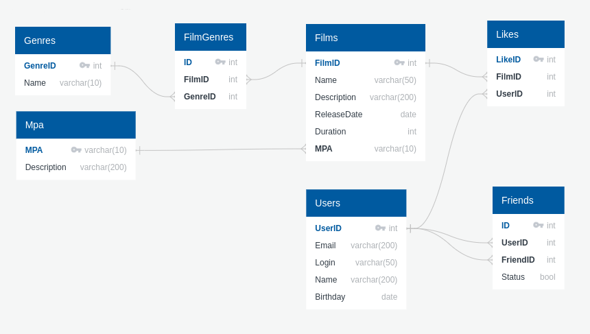

# JAVA-FILMORATE

## Описание

Бэкенд для сервиса, который будет работать с фильмами и оценками пользователей, а также возвращать топ-5 фильмов, рекомендованных к просмотру.

## Схема данных

## Технологии
* JDK Amazon Coretto version 11 - кроссплатформенный дистрибутив OpenJDK с долгосрочной поддержкой
* Spring Boot 2.7.14 - модуль фреймворка Spring для создания приложений с использованием Java
* Maven - инструмент для автоматической сборки проектов на Java
* Lombok - основанная на аннотациях библиотека Java, позволяющая сократить шаблонный код
* JDBC - API для взаимодействия с базами данных
* H2 - кроссплатформенная СУБД
## Описание коммитов
----------------------------------------------------------------------------------
| Название | Описание                                                            | 
|----------|---------------------------------------------------------------------|
| docs     | Обновление документации                                             |
| feat     | Добавление нового функционала                                       | 
| fix      | Исправление ошибок                                                  |
| refactor | Правки кода без исправления ошибок или добавления нового функционала|
| style    | Правки по codestyle (табы, отступы, точки, запятые и т.д.)          |
| test     | Добавление тестов                                                   |
----------------------------------------------------------------------------------